PUBG Exploratory Data Analysis
================
Jonathan Hung
December 03, 2018

true

PUBG Finish Placement Prediction Exploratory Data Analysis
==========================================================

Player Unknown's Battleground (PUBG) is a battle-royale style game. A dataset containing 6.38 million rows can be found on Kaggle containing data collected from matches. This has been split into 4.45 million rows for training and 1.93 million rows for testing. The goal is to predict the winPlacePerc where 1 is a win and 0 is a loss and everything in between is essentially the placement percentile of the player in the match.

For this Rmarkdown document, we will focus on exploratory data analysis to better understand the features in the dataset and what might work for feature engineering later on.

R Imports
---------

Import the dataset, convert it to a dataframe for ease of use and finally import the libraries we will be using here.

``` r
library(readr)
train <- read_csv("train_V2.csv")
```

    ## Parsed with column specification:
    ## cols(
    ##   .default = col_integer(),
    ##   Id = col_character(),
    ##   groupId = col_character(),
    ##   matchId = col_character(),
    ##   damageDealt = col_double(),
    ##   longestKill = col_double(),
    ##   matchType = col_character(),
    ##   rideDistance = col_double(),
    ##   swimDistance = col_double(),
    ##   walkDistance = col_double(),
    ##   winPlacePerc = col_double()
    ## )

    ## See spec(...) for full column specifications.

``` r
View(train)
```

``` r
# convert to dataframe for ease of use
train_df <- as.data.frame(train)
```

``` r
# import libraries needed
library(ggplot2, quietly = TRUE, warn.conflicts = FALSE)
```

    ## Warning: package 'ggplot2' was built under R version 3.4.4

``` r
library(reshape2, quietly = TRUE, warn.conflicts = FALSE)
```

    ## Warning: package 'reshape2' was built under R version 3.4.4

``` r
library(dplyr, quietly = TRUE, warn.conflicts = FALSE)
```

    ## Warning: package 'dplyr' was built under R version 3.4.4

Summary of the data
-------------------

There are a number of columns in the dataset. They are:

-   \*\* DNBOs \*\*: Number of enemy players knocked
-   \*\* assists \*\*: Number of enemy players this player damaged that were killed by teammates.
-   \*\* boosts \*\*: Number of boost items used
-   \*\* damageDealt \*\*: Total damage dealt. Note: Self inflicted damage is subtracted.
-   \*\* headshotKills \*\*: Number of enemy players killed with headshots.
-   \*\* heals \*\*: Number of healing items used.
-   \*\* Id \*\*: Player's Id
-   \*\* killPlace \*\*: Ranking in match of number of enemy players killed.
-   \*\* killPoints \*\*: Kills-based external ranking of player. (Think of this as an Elo ranking where only kills matter.) If there is a value other than -1 in rankPoints, then any 0 in killPoints should be treated as a "None"
-   \*\* killStreaks \*\*: Max number of enemy players killed in a short amount of time.
-   \*\* kills \*\*: Number of enemy players killed.
-   \*\* longestKills \*\*: Longest distance between player and player killed at time of death. This may be misleading, as downing a player and driving away may lead to a large longestKill stat.
-   \*\* matchDuration \*\*: Duration of match in seconds.
-   \*\* matchID \*\*: ID to identify match. There are no matches that are in both the training and testing set.
-   \*\* matchType \*\*: String identifying the game mode that the data comes from. The standard modes are "solo", "duo", "squad", "solo-fpp", "duo-fpp", and "squad-fpp"; other modes are from events or custom matches.
-   \*\* rankPoints \*\*: Elo-like ranking of player. This ranking is inconsistent and is being deprecated in the API's next version, so use with caution. Value of -1 takes place of "None".
-   \*\* revives \*\* : Number of times this player revived teammates.
-   \*\* rideDistance \*\*: Total distance traveled in vehicles measured in meters.
-   \*\* roadKills \*\*: Number of kills while in a vehicle.
-   \*\* swimDistance \*\*: Total distance traveled by swimming measured in meters.
-   \*\* teamKills \*\*: Number of times this player killed a teammate.
-   \*\* vehicleDestroys \*\*: Number of vehicles destroyed.
-   \*\* walkDistance \*\*: Total distance traveled on foot measured in meters.
-   \*\* weaponsAcquired \*\*: Number of weapons picked up.
-   \*\* winPoints \*\*: Win-based external ranking of player. (Think of this as an Elo ranking where only winning matters.) If there is a value other than -1 in rankPoints, then any 0 in winPoints should be treated as a "None".
-   \*\* groupID \*\*: ID to identify a group within a match. If the same group of players plays in different matches, they will have a different groupId each time.
-   \*\* numGroups \*\*: Number of groups we have data for in the match.
-   \*\* maxPlace: Worst placement we have data for in the match. This may not match with numGroups, as sometimes the data skips over placements.
-   \*\* winPlacePerc \*\*: The target of prediction. This is a percentile winning placement, where 1 corresponds to 1st place, and 0 corresponds to last place in the match. It is calculated off of maxPlace, not numGroups, so it is possible to have missing chunks in a match.

And a quick summary of the data:

``` r
# summary of the dataframe
summary(train_df)
```

    ##       Id              groupId            matchId         
    ##  Length:4446966     Length:4446966     Length:4446966    
    ##  Class :character   Class :character   Class :character  
    ##  Mode  :character   Mode  :character   Mode  :character  
    ##                                                          
    ##                                                          
    ##                                                          
    ##                                                          
    ##     assists            boosts        damageDealt          DBNOs        
    ##  Min.   : 0.0000   Min.   : 0.000   Min.   :   0.00   Min.   : 0.0000  
    ##  1st Qu.: 0.0000   1st Qu.: 0.000   1st Qu.:   0.00   1st Qu.: 0.0000  
    ##  Median : 0.0000   Median : 0.000   Median :  84.24   Median : 0.0000  
    ##  Mean   : 0.2338   Mean   : 1.107   Mean   : 130.72   Mean   : 0.6579  
    ##  3rd Qu.: 0.0000   3rd Qu.: 2.000   3rd Qu.: 186.00   3rd Qu.: 1.0000  
    ##  Max.   :22.0000   Max.   :33.000   Max.   :6616.00   Max.   :53.0000  
    ##                                                                        
    ##  headshotKills         heals         killPlace       killPoints  
    ##  Min.   : 0.0000   Min.   : 0.00   Min.   :  1.0   Min.   :   0  
    ##  1st Qu.: 0.0000   1st Qu.: 0.00   1st Qu.: 24.0   1st Qu.:   0  
    ##  Median : 0.0000   Median : 0.00   Median : 47.0   Median :   0  
    ##  Mean   : 0.2268   Mean   : 1.37   Mean   : 47.6   Mean   : 505  
    ##  3rd Qu.: 0.0000   3rd Qu.: 2.00   3rd Qu.: 71.0   3rd Qu.:1172  
    ##  Max.   :64.0000   Max.   :80.00   Max.   :101.0   Max.   :2170  
    ##                                                                  
    ##      kills          killStreaks      longestKill      matchDuration 
    ##  Min.   : 0.0000   Min.   : 0.000   Min.   :   0.00   Min.   :   9  
    ##  1st Qu.: 0.0000   1st Qu.: 0.000   1st Qu.:   0.00   1st Qu.:1367  
    ##  Median : 0.0000   Median : 0.000   Median :   0.00   Median :1438  
    ##  Mean   : 0.9248   Mean   : 0.544   Mean   :  23.00   Mean   :1580  
    ##  3rd Qu.: 1.0000   3rd Qu.: 1.000   3rd Qu.:  21.32   3rd Qu.:1851  
    ##  Max.   :72.0000   Max.   :20.000   Max.   :1094.00   Max.   :2237  
    ##                                                                     
    ##   matchType            maxPlace       numGroups        rankPoints  
    ##  Length:4446966     Min.   :  1.0   Min.   :  1.00   Min.   :  -1  
    ##  Class :character   1st Qu.: 28.0   1st Qu.: 27.00   1st Qu.:  -1  
    ##  Mode  :character   Median : 30.0   Median : 30.00   Median :1443  
    ##                     Mean   : 44.5   Mean   : 43.01   Mean   : 892  
    ##                     3rd Qu.: 49.0   3rd Qu.: 47.00   3rd Qu.:1500  
    ##                     Max.   :100.0   Max.   :100.00   Max.   :5910  
    ##                                                                    
    ##     revives         rideDistance        roadKills        
    ##  Min.   : 0.0000   Min.   :    0.00   Min.   : 0.000000  
    ##  1st Qu.: 0.0000   1st Qu.:    0.00   1st Qu.: 0.000000  
    ##  Median : 0.0000   Median :    0.00   Median : 0.000000  
    ##  Mean   : 0.1647   Mean   :  606.12   Mean   : 0.003496  
    ##  3rd Qu.: 0.0000   3rd Qu.:    0.19   3rd Qu.: 0.000000  
    ##  Max.   :39.0000   Max.   :40710.00   Max.   :18.000000  
    ##                                                          
    ##   swimDistance        teamKills        vehicleDestroys   
    ##  Min.   :   0.000   Min.   : 0.00000   Min.   :0.000000  
    ##  1st Qu.:   0.000   1st Qu.: 0.00000   1st Qu.:0.000000  
    ##  Median :   0.000   Median : 0.00000   Median :0.000000  
    ##  Mean   :   4.509   Mean   : 0.02387   Mean   :0.007918  
    ##  3rd Qu.:   0.000   3rd Qu.: 0.00000   3rd Qu.:0.000000  
    ##  Max.   :3823.000   Max.   :12.00000   Max.   :5.000000  
    ##                                                          
    ##   walkDistance     weaponsAcquired    winPoints       winPlacePerc   
    ##  Min.   :    0.0   Min.   :  0.00   Min.   :   0.0   Min.   :0.0000  
    ##  1st Qu.:  155.1   1st Qu.:  2.00   1st Qu.:   0.0   1st Qu.:0.2000  
    ##  Median :  685.6   Median :  3.00   Median :   0.0   Median :0.4583  
    ##  Mean   : 1154.2   Mean   :  3.66   Mean   : 606.5   Mean   :0.4728  
    ##  3rd Qu.: 1976.0   3rd Qu.:  5.00   3rd Qu.:1495.0   3rd Qu.:0.7407  
    ##  Max.   :25780.0   Max.   :236.00   Max.   :2013.0   Max.   :1.0000  
    ##                                                      NA's   :1

First 5 rows of the dataset for a better idea of the structure of the data:

``` r
# first 5 rows of dataset
head(train_df, 5)
```

    ##               Id        groupId        matchId assists boosts damageDealt
    ## 1 7f96b2f878858a 4d4b580de459be a10357fd1a4a91       0      0        0.00
    ## 2 eef90569b9d03c 684d5656442f9e aeb375fc57110c       0      0       91.47
    ## 3 1eaf90ac73de72 6a4a42c3245a74 110163d8bb94ae       1      0       68.00
    ## 4 4616d365dd2853 a930a9c79cd721 f1f1f4ef412d7e       0      0       32.90
    ## 5 315c96c26c9aac de04010b3458dd 6dc8ff871e21e6       0      0      100.00
    ##   DBNOs headshotKills heals killPlace killPoints kills killStreaks
    ## 1     0             0     0        60       1241     0           0
    ## 2     0             0     0        57          0     0           0
    ## 3     0             0     0        47          0     0           0
    ## 4     0             0     0        75          0     0           0
    ## 5     0             0     0        45          0     1           1
    ##   longestKill matchDuration matchType maxPlace numGroups rankPoints
    ## 1        0.00          1306 squad-fpp       28        26         -1
    ## 2        0.00          1777 squad-fpp       26        25       1484
    ## 3        0.00          1318       duo       50        47       1491
    ## 4        0.00          1436 squad-fpp       31        30       1408
    ## 5       58.53          1424  solo-fpp       97        95       1560
    ##   revives rideDistance roadKills swimDistance teamKills vehicleDestroys
    ## 1       0       0.0000         0         0.00         0               0
    ## 2       0       0.0045         0        11.04         0               0
    ## 3       0       0.0000         0         0.00         0               0
    ## 4       0       0.0000         0         0.00         0               0
    ## 5       0       0.0000         0         0.00         0               0
    ##   walkDistance weaponsAcquired winPoints winPlacePerc
    ## 1       244.80               1      1466       0.4444
    ## 2      1434.00               5         0       0.6400
    ## 3       161.80               2         0       0.7755
    ## 4       202.70               3         0       0.1667
    ## 5        49.75               2         0       0.1875

Kills
-----

Do more kills result in a better win placement? Consider that eliminating enemies means fewer people to compete against as well as access to whatever they were carrying as loot. Kills would also indicate some skill meaning the player would likely win more than the average.

``` r
# find the average, max, min and 99th percentile of kills
print(paste("On average, a player gets", round(mean(train_df$kills), 2), 
            "kills and 99% of players have", quantile(train_df$kills, 0.99), 
            "kills or less.  The most kills recorded is",max(train_df$kills), 
            ". The least kills recorded is", min(train_df$kills), "."))
```

    ## [1] "On average, a player gets 0.92 kills and 99% of players have 7 kills or less.  The most kills recorded is 72 . The least kills recorded is 0 ."

``` r
# counts of kills
kills_0 <- sum(train_df$kills == 0)
kills_1 <- sum(train_df$kills == 1)
kills_2 <- sum(train_df$kills == 2)
kills_3 <- sum(train_df$kills == 3)
kills_4 <- sum(train_df$kills == 4)
kills_5 <- sum(train_df$kills == 5)
kills_6 <- sum(train_df$kills == 6)
kills_7 <- sum(train_df$kills == 7)
kills_8 <- sum(train_df$kills > 7)
```

``` r
# now we can plot them
# dataframe of the data we want plotted
kills_df <- data.frame(Kills = c("0", "1", "2", "3", "4", "5", "6", "7", "8+"),
                       Numbers = c(kills_0, kills_1, kills_2, kills_3, kills_4, kills_5,
                                   kills_6, kills_7, kills_8))

# plot
ggplot(kills_df, aes(Kills, Numbers)) +
  theme_minimal() +
  xlab("Number of Players") +
  ylab("Kills") +
  ggtitle("Number of kills per player") +
  geom_col()
```

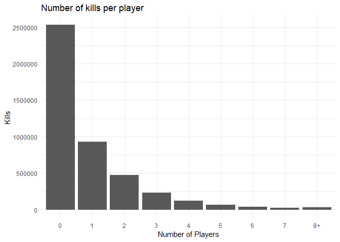

Most players have difficulty in getting a kill. Are their kills being stolen or are they hiding most of the game?

``` r
# pull rows of data where players got 0 kills
zero_kills_df <- train_df[train_df$kills == 0, ]
```

``` r
# plot a histogram of damage dealt
ggplot(zero_kills_df, aes(damageDealt)) +
  xlab("Damage Dealt") +
  ylab("Number of players") +
  ggtitle("Distribution of damage that players with 0 kills deal") +
  theme_minimal() +
  geom_histogram(binwidth = 10)
```

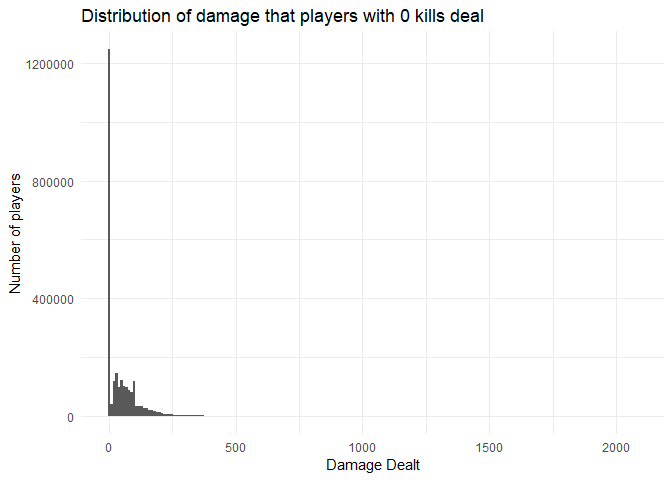

And the vast majority are doing nothing. But maybe everyone is like this and try to kill steal each other (ie. a lot of kills, but less damage)?

``` r
# kills to damage chart
ggplot(train_df, aes(x = kills, y = damageDealt)) +
  theme_minimal() +
  xlab("Kills") +
  ylab("Damage Dealt") +
  ggtitle("Correlation between Damage Dealt and Kills") +
  geom_point() +
  geom_smooth(method = "lm", aes(colour = "red"), se = FALSE, show.legend = FALSE )
```

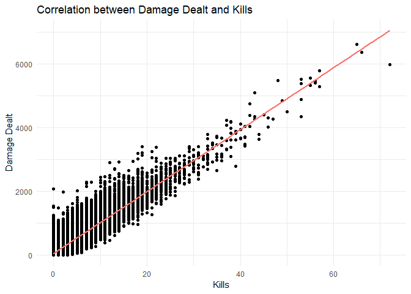

So we see that dealing more damage generally leads to getting more kills. Almost a linear relationship and kind of expected.

But what if it's like Dota2, where kills mean nothing and barracks mean everything? Does killing more people result in winning more often or is it just for stroking your ego and stealing people's gear?

``` r
# plot kills to win percentile
ggplot(train_df, aes(x = winPlacePerc, y = kills)) +
  theme_minimal() +
  xlab("Win Place Percentile") +
  ylab("Kills") +
  ggtitle("Correlation between Kills and Win Place Percentile") +
  geom_point() +
  geom_smooth(method = "lm", aes(colour = "red"), se = FALSE, show.legend = FALSE)
```

    ## Warning: Removed 1 rows containing non-finite values (stat_smooth).

    ## Warning: Removed 1 rows containing missing values (geom_point).

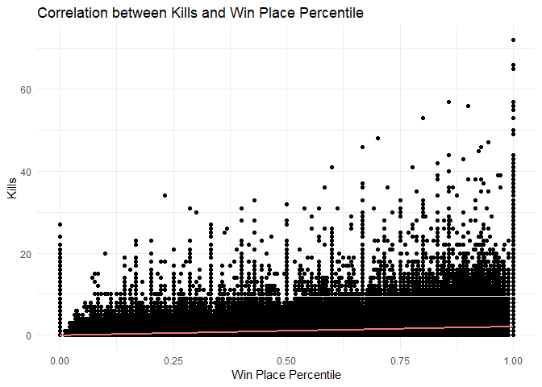

We can see that there is some correlation between killing players and winning the game.

Travelling
----------

Does travelling for longer distances result in a better win percentile? Consider that going to further places means access to more equipment to strengthen your character rather than being stuck with whatever you can find in the area.

On the other hand, travelling further might mean that you can't hide as much and hope that everyone else forgets that you exist and kills each other (since moving would increases the likelihood that you will get spotted and/or encounter more players).

### General Travel

``` r
print(paste("On average, players will walk", round(mean(train_df$walkDistance), 2),
            "meters , ride", round(mean(train_df$rideDistance),2), "meters and swim",
            round(mean(train_df$swimDistance), 2), "meter."))
```

    ## [1] "On average, players will walk 1154.22 meters , ride 606.12 meters and swim 4.51 meter."

``` r
# create new dataframe to melt
travel <- data.frame("walkDistance" = train_df$walkDistance, 
                     "rideDistance" = train_df$rideDistance, 
                     "swimDistance" = train_df$swimDistance)

# melting
travel_melt <- melt(travel)
```

    ## No id variables; using all as measure variables

``` r
# plot multiple boxplots to show distribution of each of the variables
# coord_cartesian to zoom in because the amount of outliers makes it difficult to see
# the box plot itself
ggplot(travel_melt, aes(x = travel_melt$variable, y = travel_melt$value)) +
  theme_minimal() +
  xlab("Mode of Transport") +
  ylab("Distance (meters)") + 
  ggtitle("Distribution of each mode of transport") +
  geom_boxplot() +
  coord_cartesian(ylim = c(0, 3000))
```

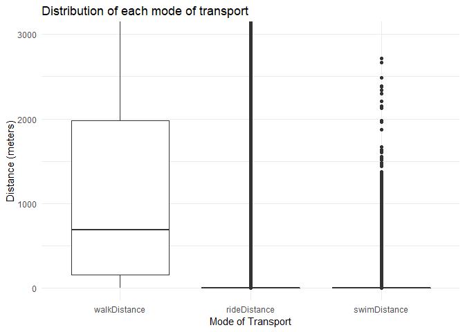

Not many people seem to know you can ride or swim in the game. But everyone likes to walk/run everywhere.

### Walking

First, we look at walking.

``` r
# walking plot
ggplot(train_df, aes(x = winPlacePerc, y = walkDistance)) +
  geom_point() +
  theme_minimal() +
  xlab("Win Place Percentage") +
  ylab("Distance Walked") +
  ggtitle("Correlation between Distance Walked and Win Place Percentage") +
  geom_smooth(method = "lm", aes(colour = "red"), se = FALSE, show.legend = FALSE)
```

    ## Warning: Removed 1 rows containing non-finite values (stat_smooth).

    ## Warning: Removed 1 rows containing missing values (geom_point).

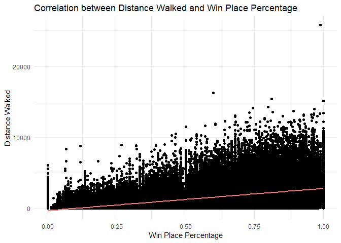

### Driving

Next we take a look at driving around the place.

``` r
# ride distance plot
ggplot(train_df, aes(x = winPlacePerc, y = rideDistance)) +
  theme_minimal() +
  xlab("Win Place Percentage") +
  ylab("Distance Driven") +
  ggtitle("Correlation between Distance Driven and Win Place Percentage") +
  geom_point() +
  geom_smooth(method = "lm", aes(colour = "red"), se = FALSE, show.legend = FALSE)
```

    ## Warning: Removed 1 rows containing non-finite values (stat_smooth).

    ## Warning: Removed 1 rows containing missing values (geom_point).

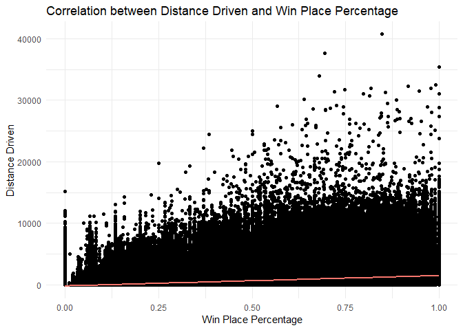

### Swimming

Finally, we look at whether swimming places means you might win more.

``` r
# swim distance plot
ggplot(train_df, aes(x = winPlacePerc, y = swimDistance)) +
  theme_minimal() +
  xlab("Win Place Percentage") +
  ylab("Distance swum") +
  ggtitle("Correlation between Distance Swum and Win Place Percentage") +
  geom_point() +
  geom_smooth(method = "lm", aes(colour = "red"), se = FALSE, show.legend = FALSE)
```

    ## Warning: Removed 1 rows containing non-finite values (stat_smooth).

    ## Warning: Removed 1 rows containing missing values (geom_point).

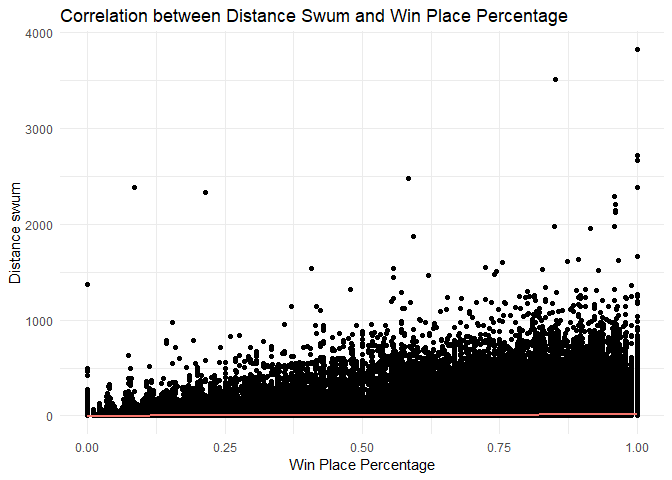

### Conclusion

We can see that, at least for walking and driving, going further distances leads to a higher win place percentile. Likely that being mobile lets keeps your options open versus limiting yourself to a small area. In addition, more gear can be found by travelling to other areas instead of looting the area you started in dry.

Healing
-------

Does healing correspond to a higher win percentile? Consider that more healing probably means that the player is engaged in more combat, which we have seen corresponds to a higher win percentile. Also consider that if you have the opportunity to heal, you are probably not dead.

``` r
print(paste("On average, players use", round(mean(train_df$heals), 2), 
            "healing items per game.  99% of players use less than", 
            quantile(train_df$heals, 0.99), "healing items per game."))
```

    ## [1] "On average, players use 1.37 healing items per game.  99% of players use less than 12 healing items per game."

Now, does it actually improve your chances of winning?

``` r
# plot heals against win place percentage
ggplot(train_df, aes(x = winPlacePerc, y = heals)) +
  theme_minimal() +
  xlab("Win Place Percentage") +
  ylab("Number of healing items used") +
  ggtitle("Correlation between healing items used and Win Place Percentage") +
  geom_point() +
  geom_smooth(method = "lm", aes(colour = "red"), se = FALSE, show.legend = FALSE)
```

    ## Warning: Removed 1 rows containing non-finite values (stat_smooth).

    ## Warning: Removed 1 rows containing missing values (geom_point).

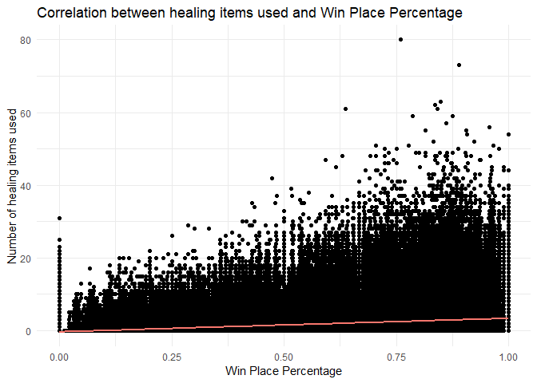

And it does!

Weapon Acquisition
------------------

Acquiring more weapons makes you stronger than other players, on the other hand it usually requires you to travel more, exposing the player to more enemies and an untimely death because the weapon spawns are randomly generated. So does weapon acquisition correspond to a higher win placement?

``` r
print(paste("The average player acquires", round(mean(train_df$weaponsAcquired), 2),
            "weapons and 99% of players acquire less than", 
            quantile(train_df$weaponsAcquired, 0.99), "weapons."))
```

    ## [1] "The average player acquires 3.66 weapons and 99% of players acquire less than 10 weapons."

``` r
# weapon acquisition plot to winPlacePerc
ggplot(train_df, aes(x = winPlacePerc, y = weaponsAcquired)) +
  theme_minimal() +
  xlab("Win Placement Percentile") +
  ylab("Weapons Acquired") +
  ggtitle("Correlation between Weapons Acquired and Win Place Percentile") + 
  geom_point() +
  geom_smooth(method = "lm", aes(colour = "red"), se = FALSE, show.legend = FALSE)
```

    ## Warning: Removed 1 rows containing non-finite values (stat_smooth).

    ## Warning: Removed 1 rows containing missing values (geom_point).

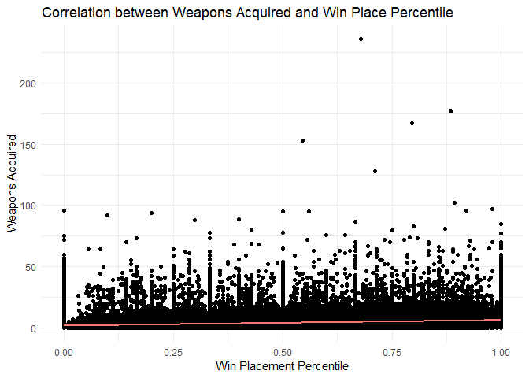

We can see that there is some correlation between acquiring more weapons and winning. Acquiring more weapons means that you are probably upgrading your weapon to a better one, giving you a higher chance of winning the game.

Boosts
------

Boosts are items that allow for healing yourself above 75% (healing items can only heal you up to 75%). In addition, if enough boosts are applied, a player is able to travel faster. Since healing yourself to full is useful and speed is the essence of war...

``` r
print(paste("On average, players will use", round(mean(train_df$boosts), 2),
            "boost items per game and 99% will use less than", quantile(train_df$boosts, 0.99),
            "boost items per game."))
```

    ## [1] "On average, players will use 1.11 boost items per game and 99% will use less than 7 boost items per game."

And does it correlate to a win?

``` r
# plot winning against boosts
ggplot(train_df, aes(x = winPlacePerc, y = boosts)) +
  theme_minimal() +
  xlab("Win Place Percentile") +
  ylab("Number of boosts used") +
  ggtitle("Correlation between Number of boosts used and Win Place Percentile") +
  geom_point() +
  geom_smooth(method = "lm", aes(colour = "red"), se = FALSE, show.legend = FALSE)
```

    ## Warning: Removed 1 rows containing non-finite values (stat_smooth).

    ## Warning: Removed 1 rows containing missing values (geom_point).

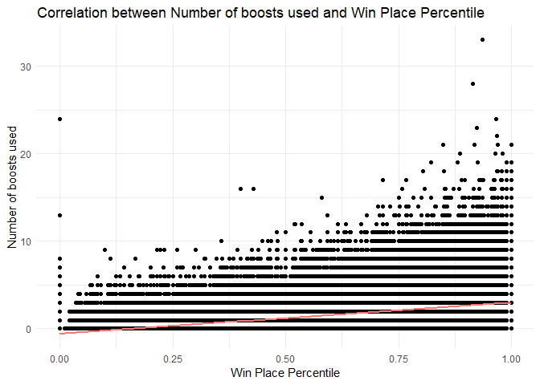

So we can see that there is some correlation between using boosts and winning.

Skill
-----

Players with more skill will obviously outperform those with less. Skill is hard to measure but we do have some variables that could show that. For instance, head shots require some skill to pull off compared to just spraying and praying. Killing vehicles is also hard, so skill would be required for that too. Long-range shots is another to consider, although we must remember that this variable can be misleading as noted by the dataset.

``` r
print(paste("On average, players achieve", round(mean(train_df$headshotKills), 2),
            "head shot kills and ", round(mean(train_df$vehicleDestroys), 2), 
            "vehicle kills per game.  Players also kill others at a distance of",
            round(mean(train_df$longestKill), 2), "meters on average."))
```

    ## [1] "On average, players achieve 0.23 head shot kills and  0.01 vehicle kills per game.  Players also kill others at a distance of 23 meters on average."

So players generally struggle to head shot people or kill any amount of vehicles. This might indicate that achieving either of these is more an outlier versus the norm so it might be ignorable.

### Headshot Kills

We take a look at how headshot kills influences win place percentile.

``` r
ggplot(train_df, aes(x = winPlacePerc, y = headshotKills)) +
  theme_minimal() +
  xlab("Win Place Percentile") +
  ylab("Headshot Kills") +
  ggtitle("Correlation of Headshot Kills with Win Place Percentile") +
  geom_point() +
  geom_smooth(method = "lm", aes(colour = "red"), se = FALSE, show.legend = FALSE) +
  geom_smooth(method = "glm", aes(colour = "blue"), se = FALSE, 
              method.args = list(family = "poisson"), show.legend = FALSE)
```

    ## Warning: Removed 1 rows containing non-finite values (stat_smooth).

    ## Warning: Removed 1 rows containing non-finite values (stat_smooth).

    ## Warning: Removed 1 rows containing missing values (geom_point).

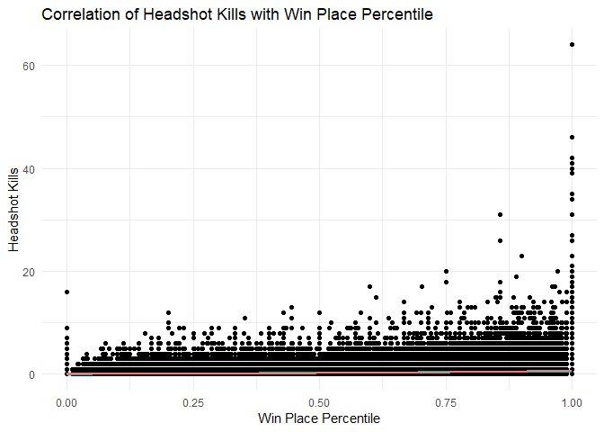

### Vehicle Kills

And what about for vehicle kills?

``` r
ggplot(train_df, aes(x = winPlacePerc, y = vehicleDestroys )) +
  theme_minimal() +
  xlab("Win Place Percentile") +
  ylab("Vehicles Destroyed") +
  ggtitle("Correlation between Vehicles Destroyed and Win Place Percentile") +
  geom_point() +
  geom_smooth(method = "lm", aes(colour = "red"), se = FALSE, show.legend = FALSE) +
  geom_smooth(method = "glm", aes(colour = "blue"), se = FALSE, 
              method.args = list(family = "poisson"), show.legend = FALSE)
```

    ## Warning: Removed 1 rows containing non-finite values (stat_smooth).

    ## Warning: Removed 1 rows containing non-finite values (stat_smooth).

    ## Warning: Removed 1 rows containing missing values (geom_point).

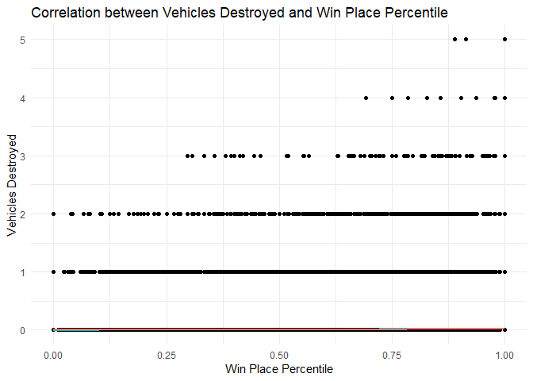

### Longest Kills

And lastly what about long range kills?

``` r
# plot for long range kills to winPlacePerc
ggplot(train_df, aes(x = winPlacePerc, y = longestKill)) +
  theme_minimal() +
  xlab("Win Place Percentile") +
  ylab("Distance of longest range kill") +
  ggtitle("Correlation between Win Place Percentile and longest distance kill") +
  geom_point() +
  geom_smooth(method = "lm", aes(colour = "red"), se = FALSE, show.legend = FALSE)
```

    ## Warning: Removed 1 rows containing non-finite values (stat_smooth).

    ## Warning: Removed 1 rows containing missing values (geom_point).

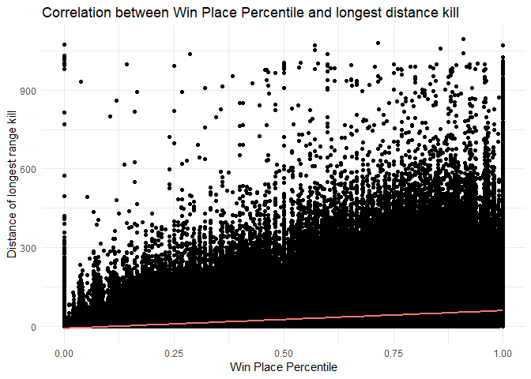

So there is little correlation between headshot kills and vehicles destroyed with win place percentile, both linearly or logistically. Long range kills, however, offer some correlation with a higher win placement.

Solos, Duos and Squads
----------------------

PUBG allows you to play on your own or in teams of 2 or 4 people. There is also a game mode where you play in 1st person instead of 3rd person. How many matches in the dataset are of each type?

``` r
# create a new dataframe to manipulate
matchId_unique <- train_df

# find all rows with unique matchIds
# this corresponds to the number of matches in the dataset
matchId_unique <- matchId_unique[!duplicated(matchId_unique[,c("matchId")]),]

# number of each type of match
table(matchId_unique$matchType)
```

    ## 
    ##         crashfpp         crashtpp              duo          duo-fpp 
    ##               73                5             3356            10620 
    ##         flarefpp         flaretpp       normal-duo   normal-duo-fpp 
    ##                9               29               12              158 
    ##      normal-solo  normal-solo-fpp     normal-squad normal-squad-fpp 
    ##               23               96               16              358 
    ##             solo         solo-fpp            squad        squad-fpp 
    ##             2297             5679             6658            18576

We can see that there are 2297 solo, 5679 solo-fpp, 3356 duo, 10620 duo-fpp, 6658 squad and 18576 squad-fpp matches played. If we combine the results to get rid of fpp matches:

``` r
# combine them
print(paste(round((2297 + 5679)/47965 * 100, 2), "% of matches are solo,", 
            round((3356 + 10620)/47965 * 100, 2), "% of matches are duo and", 
            round((6658+18756)/47965 * 100, 2),
            "% of matches are squad matches. The remainder are event or custom matches."))
```

    ## [1] "16.63 % of matches are solo, 29.14 % of matches are duo and 52.98 % of matches are squad matches. The remainder are event or custom matches."

It's worth pointing out that duo and squad teams aren't always premade. The ingame matchmaker allows a player to team up without actually have friends to play with.

In that case, we can try to see the correlation among revives, assists and teamKills, something that can only happen in a duo or squad setting, and winning. Is playing like an actual team useful or is it better to let your teammate(s) gather gear before stabbing them in the back to use it for yourself? First, we seperate out the data related to each matchType.

``` r
# dataframes containing duo and squad data only
duo_df <- rbind(train_df[train_df$matchType == "duo",], 
                 train_df[train_df$matchType == "duo-fpp",])

squad_df <- rbind(train_df[train_df$matchType == "squad",], 
                 train_df[train_df$matchType == "squad-fpp",])
```

Next, we look at duos.

``` r
ggplot() +
  theme_minimal() +
  xlab("Win Place Percentile") +
  ylab("Units of variables") +
  ggtitle("Comparison of variables to win placement percentile in duos") +
  geom_smooth(data = duo_df, aes(x = winPlacePerc, y = revives, colour = "revives"), 
              method = "lm") +
  geom_smooth(data = duo_df, aes(x = winPlacePerc, y = assists, colour = "assists"), 
              method = "lm") +
  geom_smooth(data = duo_df, aes(x = winPlacePerc, y = teamKills, colour = "teamKills"), 
              method = "lm") +
  scale_colour_manual(values = c("red", "blue", "green"))
```

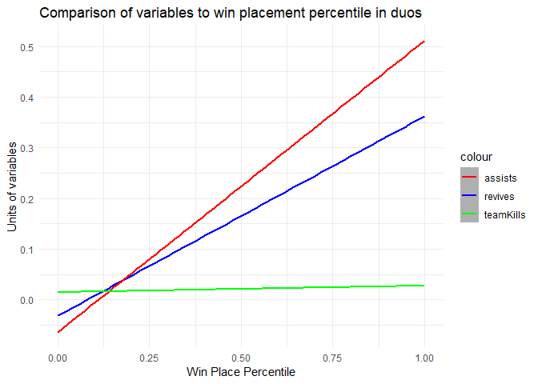

And then squads.

``` r
ggplot() +
  theme_minimal() +
  xlab("Win Place Percentile") +
  ylab("Units of variables") +
  ggtitle("Comparison of variables to win placement percentile in squads") +
  geom_smooth(data = squad_df, aes(x = winPlacePerc, y = revives, colour = "revives"), 
              method = "lm") +
  geom_smooth(data = squad_df, aes(x = winPlacePerc, y = assists, colour = "assists"), 
              method = "lm") +
  geom_smooth(data = squad_df, aes(x = winPlacePerc, y = teamKills, colour = "teamKills"), 
              method = "lm") +
  scale_colour_manual(values = c("red", "blue", "green"))
```

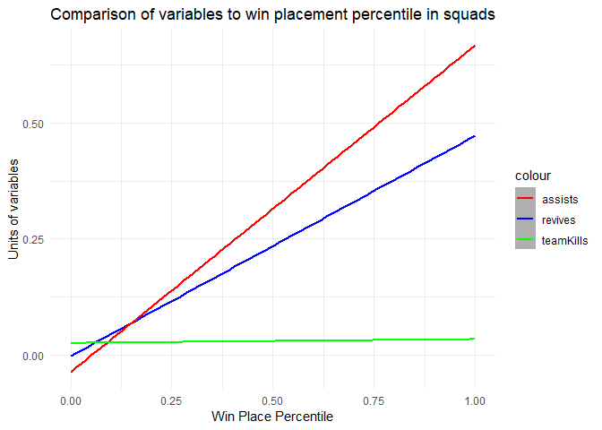

In each case, assiting and reviving teammates leads to a higher Win Place. The lack of teamkilling the in the data, however, makes it hard to decide whether there's an actual lack of effect of teamkilling or not.

But is there a difference between the duos and squads for assists and revives?

``` r
ggplot() +
  theme_minimal() +
  xlab("Win Place Percentile") +
  ylab("Units of variables") +
  ggtitle("Comparison of duos and squads") +
  geom_smooth(data = duo_df, aes(x = winPlacePerc, y = revives, colour = "duo revives"), 
              method = "lm") +
  geom_smooth(data = duo_df, aes(x = winPlacePerc, y = assists, colour = "duo assists"), 
              method = "lm") +
  geom_smooth(data = squad_df, aes(x = winPlacePerc, y = revives, colour = "squad revives"), 
              method = "lm") +
  geom_smooth(data = squad_df, aes(x = winPlacePerc, y = assists, colour = "squad assists"), 
              method = "lm") +
  scale_colour_manual(values = c("red", "blue", "green", "purple"))
```

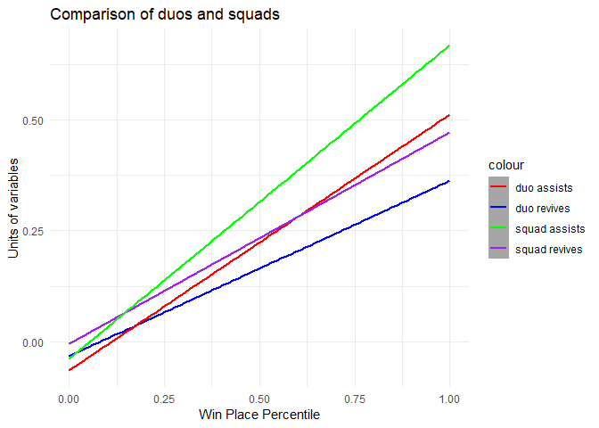

In duos, assists are more important than revives while the opposite is true for squads. Then there is also DBNOs, where a player can knock down another player before outright killing them, giving their teammate a chance to revive them.

``` r
ggplot() +
  theme_minimal() +
  xlab("Win Place Percentile") +
  ylab("Number of DBNOs") +
  ggtitle("Comparison of DBNOs by duos and squads") +
  geom_smooth(data = duo_df, aes(x = winPlacePerc, y = DBNOs, colour = "duo DBNOs"), 
              method = "lm") +
  geom_smooth(data = squad_df, aes(x = winPlacePerc, y = DBNOs, colour = "squad DBNOs"), 
              method = "lm") + 
  scale_colour_manual(values = c("red", "blue"))
```

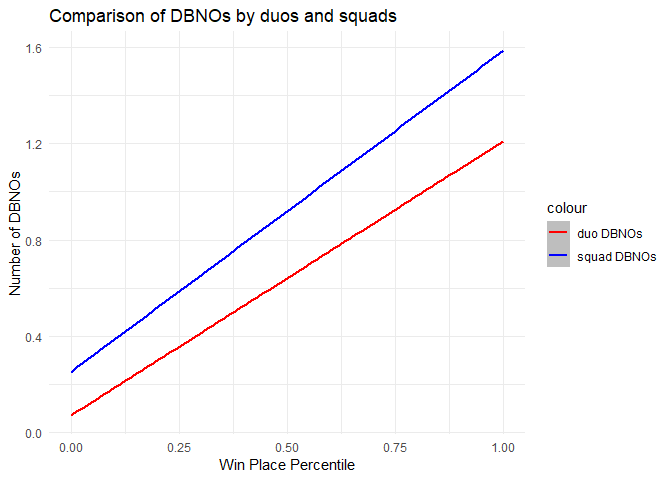

More DBNOs in squads is better than in duos. Additionally, just like kills, more DBNOs results in a higher win placement percentile. Expected like kills!

Conclusions
-----------

There are a number of correlations between the data provided and the winPlacePerc. We can try feature engineering to try to make the variables give us a better prediction in the modelling stage.
