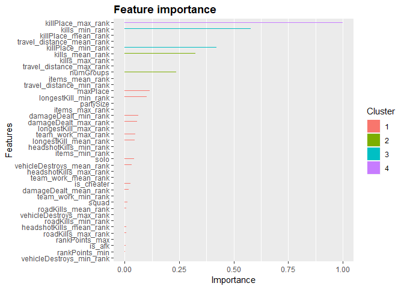
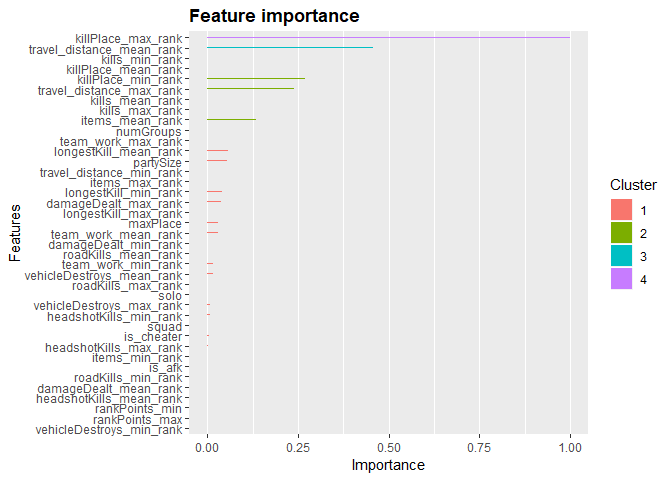
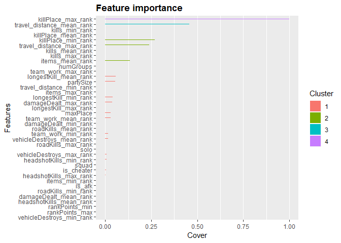
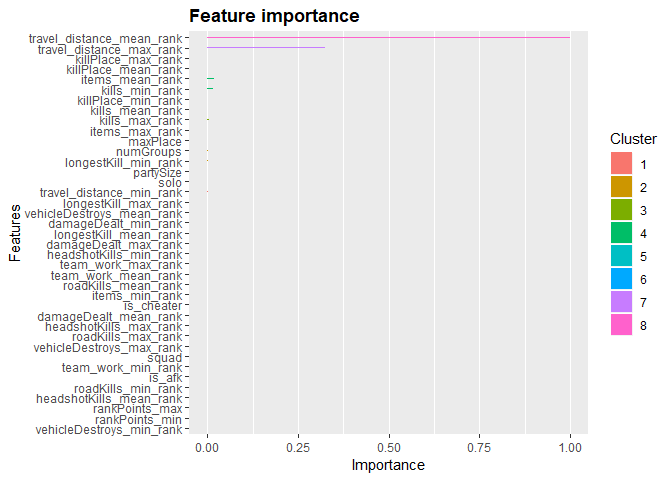
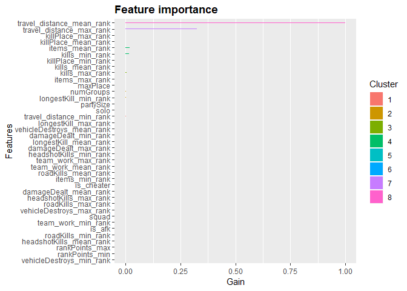

PUBG Modelling
================
Jonathan Hung
December 13, 2018

PUBG Modelling
==============

The goal of this file is to process, engineer and model the PUBG dataset for competition submission.

Imports
-------

Import the datasets, commit them to dataframes and import useful libraries.

``` r
# import the datasets
library(readr)
train <- read_csv("train_V2.csv")
```

    ## Parsed with column specification:
    ## cols(
    ##   .default = col_integer(),
    ##   Id = col_character(),
    ##   groupId = col_character(),
    ##   matchId = col_character(),
    ##   damageDealt = col_double(),
    ##   longestKill = col_double(),
    ##   matchType = col_character(),
    ##   rideDistance = col_double(),
    ##   swimDistance = col_double(),
    ##   walkDistance = col_double(),
    ##   winPlacePerc = col_double()
    ## )

    ## See spec(...) for full column specifications.

``` r
test <- read_csv("test_V2.csv")
```

    ## Parsed with column specification:
    ## cols(
    ##   .default = col_integer(),
    ##   Id = col_character(),
    ##   groupId = col_character(),
    ##   matchId = col_character(),
    ##   damageDealt = col_double(),
    ##   longestKill = col_double(),
    ##   matchType = col_character(),
    ##   rideDistance = col_double(),
    ##   swimDistance = col_double(),
    ##   walkDistance = col_double()
    ## )
    ## See spec(...) for full column specifications.

``` r
# convert to dataframe for ease of use
train_df <- as.data.frame(train)
test_df <- as.data.frame(test)
```

``` r
# import useful libraries
library(ggplot2, quietly = TRUE, warn.conflicts = FALSE)
```

    ## Warning: package 'ggplot2' was built under R version 3.4.4

``` r
library(caret, quietly = TRUE, warn.conflicts = FALSE)
```

    ## Warning: package 'caret' was built under R version 3.4.4

``` r
library(plyr, quietly = TRUE, warn.conflicts = FALSE)
library(dplyr, quietly = TRUE, warn.conflicts = FALSE)
```

    ## Warning: package 'dplyr' was built under R version 3.4.4

``` r
library(xgboost, quietly = TRUE, warn.conflicts = FALSE)
```

    ## Warning: package 'xgboost' was built under R version 3.4.4

``` r
library(bindrcpp, quietly = TRUE, warn.conflicts = FALSE)
```

    ## Warning: package 'bindrcpp' was built under R version 3.4.4

``` r
library(Ckmeans.1d.dp, quietly = TRUE, warn.conflicts = FALSE)
```

    ## Warning: package 'Ckmeans.1d.dp' was built under R version 3.4.4

``` r
library(data.table, quietly = TRUE, warn.conflicts = FALSE)
```

    ## Warning: package 'data.table' was built under R version 3.4.4

Minor Cleaning
--------------

As found in the EDA, there is at least 1 missing value in the whole dataset. Let's take a look at where it is.

``` r
# find rows of missing data
missing_df <- train_df[rowSums(is.na(train_df)) > 0, ]
head(missing_df)
```

    ##                     Id        groupId        matchId assists boosts
    ## 2744605 f70c74418bb064 12dfbede33f92b 224a123c53e008       0      0
    ##         damageDealt DBNOs headshotKills heals killPlace killPoints kills
    ## 2744605           0     0             0     0         1          0     0
    ##         killStreaks longestKill matchDuration matchType maxPlace numGroups
    ## 2744605           0           0             9  solo-fpp        1         1
    ##         rankPoints revives rideDistance roadKills swimDistance teamKills
    ## 2744605       1574       0            0         0            0         0
    ##         vehicleDestroys walkDistance weaponsAcquired winPoints
    ## 2744605               0            0               0         0
    ##         winPlacePerc
    ## 2744605           NA

Since the winPlacePerc is missing, the row is basically pointless for training. Since the numGroups for this match is 1, we can safely assume that this is the only entry for that match and remove the row by matchId to keep the code robust.

``` r
# remove by matchId
train_df <- train_df[ !(train_df$matchId %in% c("224a123c53e008")), ]

# check that it worked
any(is.na(train_df))
```

    ## [1] FALSE

``` r
# garbage
rm(missing_df)
gc()
```

    ##             used   (Mb) gc trigger   (Mb)  max used   (Mb)
    ## Ncells  11223455  599.4   17371378  927.8  15785448  843.1
    ## Vcells 241477925 1842.4  444795507 3393.6 443875412 3386.6

Since there was a missing value in the training data, we should check the testing data just in case there's a missing value somewhere else in there.

``` r
# check test_df for null values
any(is.na(test_df))
```

    ## [1] FALSE

Feature Engineering
-------------------

From other models we built, we can see that modelling purely on individual player performance nets us a Mean Absolute Error (MAE) of about 0.0569 at best.

However, one must realize that since the game can be played in duos and squads as well, all players in duos and squads will end up with the same winPlacePerc. Thus, instead of modelling on individual performance, it's probably better to model on group performance to better capture the data.

To this end, we should split each feature into minimums, mean and maximums. This way, in a group situation, we can capture the worst, best and mean performance of players in that group. For solos, the minimum, mean and maximum will simply be the same for all values for that "group".

Ranking the data will also make it easier for the model to see a trend amongst the worse performing groups and best in the data.

First, we filter the data for numGroups that are 1. In these games, the winPlacePerc is always 0 so there's no point retaining it in the training data.

``` r
# filtering
# because games with a numGroup of 1 always have a winPlacePerc of 0
train_df <- filter(train_df, numGroups > 1)
```

Next, make some additional features to describe the data.

``` r
# create some new features
train_df <- train_df %>%
  mutate(items = heals + boosts + weaponsAcquired) %>%
  mutate(travel_distance = walkDistance + rideDistance + swimDistance) %>%
  mutate(team_work = revives + assists - teamKills * 10)
```

Now, we sort the train\_df by matchIds and groupIds and then add some additional features based on this data.

``` r
# some additional values
groups_df <- summarise(group_by(train_df, matchId, groupId), 
                       partySize=n(),
                       maxPlace = max(maxPlace),
                       numGroups = max(numGroups),
                       is_cheater = sum(ifelse((kills / travel_distance) >= 1 |
                                             kills > 18, 1, 0)),
                       is_afk = sum(ifelse(travel_distance == 0 & damageDealt == 0 &
                                          weaponsAcquired == 0, 1, 0)))
```

``` r
# set NAs as 0 for now until we figure out something better to do with them
groups_df[is.na(groups_df)] <- 0
```

We create a new dataframe, rank\_df, and find the means, mins and maxes of each group.

``` r
# find the mins, maxes and means
rank_df <- train_df %>%
  group_by(matchId, groupId) %>% 
  summarise_if(is.numeric, funs(mean, min, max))
```

And then rank everything by group, but within each match.

``` r
# rank everything, common comparison point
rank_df <- rank_df %>%
  group_by(matchId) %>%
  # mean ranks
  mutate(items_mean_rank = rank(items_mean, ties.method = "max") / numGroups_mean * 100,
         damageDealt_mean_rank = rank(damageDealt_mean, 
                                      ties.method = "max") / numGroups_mean * 100,
         team_work_mean_rank = rank(team_work_mean, ties.method = "max") / numGroups_mean * 100,
         headshotKills_mean_rank = rank(headshotKills_mean, 
                                   ties.method = "max") / numGroups_mean * 100,
         killPlace_mean_rank = rank(killPlace_mean, ties.method = "max") / numGroups_mean * 100,
         kills_mean_rank = rank(kills_mean, ties.method = "max") / numGroups_mean * 100,
         longestKill_mean_rank = rank(longestKill_mean, 
                                      ties.method = "max") / numGroups_mean * 100,
         travel_distance_mean_rank = rank(travel_distance_mean, 
                                          ties.method = "max") / numGroups_mean * 100,
         roadKills_mean_rank = rank(roadKills_mean, ties.method = "max") / numGroups_mean * 100,
         vehicleDestroys_mean_rank = rank(vehicleDestroys_mean, 
                                          ties.method = "max") / numGroups_mean * 100,
         # min ranks
         items_min_rank = rank(items_min, ties.method = "max") / numGroups_mean * 100,
         damageDealt_min_rank = rank(damageDealt_min, 
                                      ties.method = "max") / numGroups_mean * 100,
         team_work_min_rank = rank(team_work_min, ties.method = "max") / numGroups_mean * 100,
         headshotKills_min_rank = rank(headshotKills_min, 
                                   ties.method = "max") / numGroups_mean * 100,
         killPlace_min_rank = rank(killPlace_min, ties.method = "max") / numGroups_mean * 100,
         kills_min_rank = rank(kills_min, ties.method = "max") / numGroups_mean * 100,
         longestKill_min_rank = rank(longestKill_min, 
                                      ties.method = "max") / numGroups_mean * 100,
         travel_distance_min_rank = rank(travel_distance_min, 
                                          ties.method = "max") / numGroups_mean * 100,
         roadKills_min_rank = rank(roadKills_min, ties.method = "max") / numGroups_mean * 100,
         vehicleDestroys_min_rank = rank(vehicleDestroys_min, 
                                          ties.method = "max") / numGroups_mean * 100,
         # max ranks
         items_max_rank = rank(items_max, ties.method = "max") / numGroups_mean * 100,
         damageDealt_max_rank = rank(damageDealt_max, 
                                      ties.method = "max") / numGroups_mean * 100,
         team_work_max_rank = rank(team_work_max, ties.method = "max") / numGroups_mean * 100,
         headshotKills_max_rank = rank(headshotKills_max, 
                                   ties.method = "max") / numGroups_mean * 100,
         killPlace_max_rank = rank(killPlace_max, ties.method = "max") / numGroups_mean * 100,
         kills_max_rank = rank(kills_max, ties.method = "max") / numGroups_mean * 100,
         longestKill_max_rank = rank(longestKill_max, 
                                      ties.method = "max") / numGroups_mean * 100,
         travel_distance_max_rank = rank(travel_distance_max, 
                                          ties.method = "max") / numGroups_mean * 100,
         roadKills_max_rank = rank(roadKills_max, ties.method = "max") / numGroups_mean * 100,
         vehicleDestroys_max_rank = rank(vehicleDestroys_max, 
                                          ties.method = "max") / numGroups_mean * 100)
```

Now after ranking everything, we're left with a lot of rows that we no longer need. Let's remove them to reduce the space that the dataframe is taking up.

``` r
# rank_df is massive... clean up some stuff
rank_df <- select(rank_df, matchId, groupId, contains("rank"))
rank_df <- rank_df %>% mutate_if(is.integer, funs(as.numeric(.)))
```

We can join together rank\_df with groups\_df. Next, we pull all the matchType data from the original training data and one hot encode it so that the model can differentiate why solo, duo and squad games are so different. For example, why do solo players perform well despite having no DBNOs or assists?

``` r
# join stuff together
rank_df <- inner_join(rank_df, groups_df)
```

    ## Joining, by = c("matchId", "groupId")

``` r
# garbage
rm(groups_df)
gc()
```

    ##             used   (Mb) gc trigger   (Mb)  max used   (Mb)
    ## Ncells  11242684  600.5   20885653 1115.5  20885653 1115.5
    ## Vcells 330437947 2521.1  640681529 4888.1 589480150 4497.4

``` r
# grab all the unique matchIds and matchTypes
matchType_df <- data.frame(matchId = train_df$matchId, matchType = train_df$matchType)
matchType_df <- unique(matchType_df %>%
                         select(matchId, matchType))

# harmonize matchTypes
# rename solos
matchType_df$matchType[matchType_df$matchType == "normal-solo" |
                     matchType_df$matchType == "normal-solo-fpp" | 
                     matchType_df$matchType == "solo-fpp"] <- "solo"

# rename duos
matchType_df$matchType[matchType_df$matchType == "duo-fpp" |
                     matchType_df$matchType == "normal-duo" |
                     matchType_df$matchType == "normal-duo-fpp"] <- "duo"

# rename squads
matchType_df$matchType[matchType_df$matchType == "squad-fpp" | 
                     matchType_df$matchType == "normal-squad" |
                     matchType_df$matchType == "normal-squad-fpp"] <- "squad"

# rename crash
matchType_df$matchType[matchType_df$matchType == "crashfpp" |
                     matchType_df$matchType == "crashtpp"] <- "duo"

# rename flare
matchType_df$matchType[matchType_df$matchType == "flarefpp" |
                     matchType_df$matchType == "flaretpp"] <- "squad"

# remove the extra levels that are still somehow there...
matchType_df$matchType <- factor(matchType_df$matchType)

# one hot encode them
dmy <- dummyVars("~matchType", data = matchType_df, fullRank = TRUE, levelsOnly = TRUE)
dummy <- data.frame(predict(dmy, newdata = matchType_df))
matchType_df <- cbind(matchType_df, dummy)

# add to rank_df
rank_df <- inner_join(rank_df, matchType_df)
```

    ## Joining, by = "matchId"

    ## Warning: Column `matchId` joining character vector and factor, coercing
    ## into character vector

``` r
# remove matchType
rank_df <- select(rank_df, -matchType)

# garbage
rm(matchType_df, dmy, dummy)
gc()
```

    ##             used   (Mb) gc trigger   (Mb)  max used   (Mb)
    ## Ncells  11298143  603.4   20885653 1115.5  20885653 1115.5
    ## Vcells 335709052 2561.3  640681529 4888.1 589480150 4497.4

Finally, we pull the winPlacePerc from the training data and rematch it to the rank\_df data. We still need these for training and combining them here ensures that the winPlacePercs are correctly aligned with their corresponding matchId and groupId.

``` r
# readd in necessary labels
labels_df <- summarise(group_by(train_df, matchId, groupId), winPlacePerc = max(winPlacePerc))
rank_df <- inner_join(rank_df, labels_df)
```

    ## Joining, by = c("matchId", "groupId")

``` r
# garbage
rm(labels_df)
gc()
```

    ##             used   (Mb) gc trigger   (Mb)  max used   (Mb)
    ## Ncells  11249588  600.8   20885653 1115.5  20885653 1115.5
    ## Vcells 336531699 2567.6  640681529 4888.1 589480150 4497.4

Modelling
---------

We can now model the data using the XGBoost library. For this to work, we need to convert our training data into a deep matrix since XGBoost only accepts matrix input.

First, we split the training data and labels off from each other. We also alphabetize the training data because XGBoost requires the columns in the training and test data to be in the same order or it will throw an error. Alphabetizing them ensures that they will be in the same order later.

``` r
# split things up for making a deep matrix later
rank_labels <- rank_df$winPlacePerc
rank_df <- select(rank_df, -winPlacePerc)

# alphabetize things because XGBoost hates columns in different orders...
rank_df <- rank_df[, order(names(rank_df))]
```

Now, we can build the deep matrix.

``` r
# XGBoost deep matrix...
rank_matrix <- data.matrix(select(rank_df, -groupId, -matchId))
```

    ## Adding missing grouping variables: `matchId`

    ## Warning in data.matrix(select(rank_df, -groupId, -matchId)): NAs introduced
    ## by coercion

``` r
rank_matrix <- rank_matrix[, -1]
xgb_rank <- xgb.DMatrix(data = rank_matrix,
                        label = rank_labels,
                        missing = "NAN")
```

And proceed to model it. We use the eval\_metric of "mae" because the competition evaluation is MAE.

``` r
# model training
model <- xgboost(data = xgb_rank,
               eta = 0.15,
               nround = 50,
               min_child_weight = 0.5,
               subsample = 0.85,
               colsample_bytree = 0.65,
               seed = 123,
               eval_metric = "mae",
               objective = "reg:linear",
               booster = "gbtree",
               nthread = 3,
               max_depth = 6)
```

    ## [1]  train-mae:0.223215 
    ## [2]  train-mae:0.192409 
    ## [3]  train-mae:0.166527 
    ## [4]  train-mae:0.145764 
    ## [5]  train-mae:0.128580 
    ## [6]  train-mae:0.114393 
    ## [7]  train-mae:0.101610 
    ## [8]  train-mae:0.091092 
    ## [9]  train-mae:0.082384 
    ## [10] train-mae:0.075124 
    ## [11] train-mae:0.069872 
    ## [12] train-mae:0.064946 
    ## [13] train-mae:0.060728 
    ## [14] train-mae:0.057346 
    ## [15] train-mae:0.054711 
    ## [16] train-mae:0.052942 
    ## [17] train-mae:0.050976 
    ## [18] train-mae:0.049227 
    ## [19] train-mae:0.048024 
    ## [20] train-mae:0.047051 
    ## [21] train-mae:0.046329 
    ## [22] train-mae:0.045113 
    ## [23] train-mae:0.044116 
    ## [24] train-mae:0.043326 
    ## [25] train-mae:0.042644 
    ## [26] train-mae:0.042011 
    ## [27] train-mae:0.041505 
    ## [28] train-mae:0.041102 
    ## [29] train-mae:0.040745 
    ## [30] train-mae:0.040324 
    ## [31] train-mae:0.040001 
    ## [32] train-mae:0.039783 
    ## [33] train-mae:0.039609 
    ## [34] train-mae:0.039504 
    ## [35] train-mae:0.039382 
    ## [36] train-mae:0.039206 
    ## [37] train-mae:0.039144 
    ## [38] train-mae:0.039081 
    ## [39] train-mae:0.038953 
    ## [40] train-mae:0.038715 
    ## [41] train-mae:0.038533 
    ## [42] train-mae:0.038376 
    ## [43] train-mae:0.038187 
    ## [44] train-mae:0.038094 
    ## [45] train-mae:0.038049 
    ## [46] train-mae:0.037990 
    ## [47] train-mae:0.037858 
    ## [48] train-mae:0.037805 
    ## [49] train-mae:0.037664 
    ## [50] train-mae:0.037599

Predicting
----------

Now that our model has been built, we can process the test data in the same way as the training data, except that we have to keep the labels seperate to ensure that everything lines up correctly. After that, we can run the processed data into the model to output predictions.

``` r
# test_df processing

# master id, matchId and groupId
master_labels <- select(test_df, Id, matchId, groupId)

# add some features
test_df <- test_df %>%
  mutate(items = heals + boosts + weaponsAcquired) %>%
  mutate(travel_distance = walkDistance + rideDistance + swimDistance) %>%
  mutate(team_work = revives + assists - teamKills * 10)

# group up individual players into their groups and add in some features
groups_df <- summarise(group_by(test_df, matchId, groupId), partySize=n(),
                       maxPlace = max(maxPlace),
                       numGroups = max(numGroups),
                       is_cheater = sum(ifelse((kills / travel_distance) >= 1 |
                                             kills > 18, 1, 0)),
                       is_afk = sum(ifelse(travel_distance == 0 & damageDealt == 0 &
                                          weaponsAcquired == 0, 1, 0)))

# equate NA to 0 for now
groups_df[is.na(groups_df)] <- 0

# summarize mins, means and maxes
rank2_df <- test_df %>%
  group_by(matchId, groupId) %>% 
  summarise_if(is.numeric, funs(mean, min, max))

# rank everything, common comparison point
rank2_df <- rank2_df %>%
  group_by(matchId) %>%
  # mean ranks
  mutate(items_mean_rank = rank(items_mean, ties.method = "max") / numGroups_mean * 100,
         damageDealt_mean_rank = rank(damageDealt_mean, 
                                      ties.method = "max") / numGroups_mean * 100,
         team_work_mean_rank = rank(team_work_mean, ties.method = "max") / numGroups_mean * 100,
         headshotKills_mean_rank = rank(headshotKills_mean, 
                                   ties.method = "max") / numGroups_mean * 100,
         killPlace_mean_rank = rank(killPlace_mean, ties.method = "max") / numGroups_mean * 100,
         kills_mean_rank = rank(kills_mean, ties.method = "max") / numGroups_mean * 100,
         longestKill_mean_rank = rank(longestKill_mean, 
                                      ties.method = "max") / numGroups_mean * 100,
         travel_distance_mean_rank = rank(travel_distance_mean, 
                                          ties.method = "max") / numGroups_mean * 100,
         roadKills_mean_rank = rank(roadKills_mean, ties.method = "max") / numGroups_mean * 100,
         vehicleDestroys_mean_rank = rank(vehicleDestroys_mean, 
                                          ties.method = "max") / numGroups_mean * 100,
         # min ranks
         items_min_rank = rank(items_min, ties.method = "max") / numGroups_mean * 100,
         damageDealt_min_rank = rank(damageDealt_min, 
                                      ties.method = "max") / numGroups_mean * 100,
         team_work_min_rank = rank(team_work_min, ties.method = "max") / numGroups_mean * 100,
         headshotKills_min_rank = rank(headshotKills_min, 
                                   ties.method = "max") / numGroups_mean * 100,
         killPlace_min_rank = rank(killPlace_min, ties.method = "max") / numGroups_mean * 100,
         kills_min_rank = rank(kills_min, ties.method = "max") / numGroups_mean * 100,
         longestKill_min_rank = rank(longestKill_min, 
                                      ties.method = "max") / numGroups_mean * 100,
         travel_distance_min_rank = rank(travel_distance_min, 
                                          ties.method = "max") / numGroups_mean * 100,
         roadKills_min_rank = rank(roadKills_min, ties.method = "max") / numGroups_mean * 100,
         vehicleDestroys_min_rank = rank(vehicleDestroys_min, 
                                          ties.method = "max") / numGroups_mean * 100,
         # max ranks
         items_max_rank = rank(items_max, ties.method = "max") / numGroups_mean * 100,
         damageDealt_max_rank = rank(damageDealt_max, 
                                      ties.method = "max") / numGroups_mean * 100,
         team_work_max_rank = rank(team_work_max, ties.method = "max") / numGroups_mean * 100,
         headshotKills_max_rank = rank(headshotKills_max, 
                                   ties.method = "max") / numGroups_mean * 100,
         killPlace_max_rank = rank(killPlace_max, ties.method = "max") / numGroups_mean * 100,
         kills_max_rank = rank(kills_max, ties.method = "max") / numGroups_mean * 100,
         longestKill_max_rank = rank(longestKill_max, 
                                      ties.method = "max") / numGroups_mean * 100,
         travel_distance_max_rank = rank(travel_distance_max, 
                                          ties.method = "max") / numGroups_mean * 100,
         roadKills_max_rank = rank(roadKills_max, ties.method = "max") / numGroups_mean * 100,
         vehicleDestroys_max_rank = rank(vehicleDestroys_max, 
                                          ties.method = "max") / numGroups_mean * 100)

# remove everything thats not a rank and convert to numerics
rank2_df <- select(rank2_df, matchId, groupId, contains("rank"))
rank2_df <- rank2_df %>% 
  mutate_if(is.integer, funs(as.numeric(.)))

# join stuff together
rank2_df <- inner_join(rank2_df, groups_df)
```

    ## Joining, by = c("matchId", "groupId")

``` r
# garbage
rm(groups_df)
gc()
```

    ##             used   (Mb) gc trigger   (Mb)  max used   (Mb)
    ## Ncells  11306977  603.9   20885653 1115.5  20885653 1115.5
    ## Vcells 458694659 3499.6  768897834 5866.3 589480150 4497.4

``` r
# grab all the unique matchIds and matchTypes
matchType_df <- data.frame(matchId = test_df$matchId, matchType = test_df$matchType)
matchType_df <- unique(matchType_df %>%
                         select(matchId, matchType))

# harmonize matchTypes
# rename solos
matchType_df$matchType[matchType_df$matchType == "normal-solo" |
                     matchType_df$matchType == "normal-solo-fpp" | 
                     matchType_df$matchType == "solo-fpp"] <- "solo"

# rename duos
matchType_df$matchType[matchType_df$matchType == "duo-fpp" |
                     matchType_df$matchType == "normal-duo" |
                     matchType_df$matchType == "normal-duo-fpp"] <- "duo"

# rename squads
matchType_df$matchType[matchType_df$matchType == "squad-fpp" | 
                     matchType_df$matchType == "normal-squad" |
                     matchType_df$matchType == "normal-squad-fpp"] <- "squad"

# rename crash
matchType_df$matchType[matchType_df$matchType == "crashfpp" |
                     matchType_df$matchType == "crashtpp"] <- "duo"

# rename flare
matchType_df$matchType[matchType_df$matchType == "flarefpp" |
                     matchType_df$matchType == "flaretpp"] <- "squad"

# remove the extra levels that are still somehow there...
matchType_df$matchType <- factor(matchType_df$matchType)

# one hot encode them
dmy <- dummyVars("~matchType", data = matchType_df, fullRank = TRUE, levelsOnly = TRUE)
dummy <- data.frame(predict(dmy, newdata = matchType_df))
matchType_df <- cbind(matchType_df, dummy)

# add to rank2_df
rank2_df <- inner_join(rank2_df, matchType_df)
```

    ## Joining, by = "matchId"

    ## Warning: Column `matchId` joining character vector and factor, coercing
    ## into character vector

``` r
# remove matchType
rank2_df <- select(rank2_df, -matchType)

# garbage
rm(matchType_df, dmy, dummy)
gc()
```

    ##             used   (Mb) gc trigger   (Mb)  max used   (Mb)
    ## Ncells  11328047  605.0   20885653 1115.5  20885653 1115.5
    ## Vcells 460993145 3517.1  768897834 5866.3 589480150 4497.4

``` r
# alphabetize things because XGBoost hates columns in different orders...
rank2_df <- rank2_df[, order(names(rank2_df))]
```

``` r
# XGBoost deep matrix for testing purposes
rank2_matrix <- data.matrix(select(rank2_df, -groupId, -matchId))
```

    ## Adding missing grouping variables: `matchId`

    ## Warning in data.matrix(select(rank2_df, -groupId, -matchId)): NAs
    ## introduced by coercion

``` r
rank2_matrix <- rank2_matrix[, -1]
xgb_rank2 <- xgb.DMatrix(data = rank2_matrix,
                        missing = "NAN")

# garbage
gc()
```

    ##             used   (Mb) gc trigger   (Mb)  max used   (Mb)
    ## Ncells  11326987  605.0   20885653 1115.5  20885653 1115.5
    ## Vcells 496435714 3787.6  768897834 5866.3 589480150 4497.4

Now we use the testing deep matrix to make predictions.

``` r
# make predictions
predictions <- predict(model, xgb_rank2)
```

And convert it into a dataframe with the necessary labels for post processing.

``` r
# submission dataframe
submission <- data.frame(winPlacePerc = predictions)

# readd stuff
submission <- cbind(submission, rank2_df$matchId)
submission <- cbind(submission, rank2_df$groupId)

# rename stuff
names(submission)[names(submission) == "rank2_df$matchId"] <- "matchId"
names(submission)[names(submission) == "rank2_df$groupId"] <- "groupId"
```

Post-processing
---------------

Post processing is necessary in order to smooth out the results and make sure they make sense. For example, in a game of 3 players, we know that the percentiles MUST be 0, 0.5 and 1. So should there really be a percentile of 0.45?

``` r
# post processing to smooth out the winPlacePerc
# because in a game of 3 people, the percentiles should be 0, 0.5 and 1, no 0.45 should exist
submission <- submission %>% 
  group_by(matchId) %>% 
  mutate(rank = rank(winPlacePerc, ties.method="first"))

# add some data we require for post processing
data_needed_df <- data.frame(matchId = test_df$matchId, groupId = test_df$groupId,
                             numGroups = test_df$numGroups)

# find the unique combinations so we don't introduce copies into submission
data_needed_df <- unique(data_needed_df[, c("matchId", "groupId", "numGroups")])

# join them together
submission <- submission %>%
  inner_join(data_needed_df)
```

    ## Joining, by = c("matchId", "groupId")

``` r
# garbage
rm(data_needed_df)
gc()
```

    ##             used   (Mb) gc trigger   (Mb)  max used   (Mb)
    ## Ncells  11328934  605.1   20885653 1115.5  20885653 1115.5
    ## Vcells 500892105 3821.6  768897834 5866.3 589480150 4497.4

``` r
# post process the data to fit the correct percentiles
submission <- submission %>% 
  mutate(gap = 1.0 / numGroups, 
         winPlacePerc = (rank) * gap,
         winPlacePerc = ifelse(numGroups == 1, 0, winPlacePerc))

# pick out the predictions and data to match to the master label dataframe
submission <- submission %>%
  select(matchId, groupId, winPlacePerc)
```

Submission
----------

Lastly, we format the predictions with the necessary Ids to create our submission file.

``` r
# relabel the whole dataset to match the test dataset
submission <- inner_join(master_labels, submission)
```

    ## Joining, by = c("matchId", "groupId")

    ## Warning: Column `matchId` joining character vector and factor, coercing
    ## into character vector

    ## Warning: Column `groupId` joining character vector and factor, coercing
    ## into character vector

``` r
# final format
submission <- submission %>%
  select(Id, winPlacePerc)

# print the file
write_csv(submission, "submission.csv")
```

Graphing Features
-----------------

We can graph the frequency, cover and gain of the model to see what features were important to it and what can maybe be removed for later models.

``` r
# create importance matrix
importance_matrix <- xgb.importance(colnames(xgb_rank2), model = model)

# plot frequency of features in trees
(gg <- xgb.ggplot.importance(importance_matrix, measure = "Frequency", rel_to_first = TRUE))
```



``` r
gg + ggplot2::ylab("Frequency")
```


``` r
# plot the cover of the features
(gg <- xgb.ggplot.importance(importance_matrix, measure = "Cover", rel_to_first = TRUE))
```



``` r
gg + ggplot2::ylab("Cover")
```



``` r
# plot their importance by gain
(gg <- xgb.ggplot.importance(importance_matrix, measure = "Gain", rel_to_first = TRUE))
```



``` r
gg + ggplot2::ylab("Gain")
```


