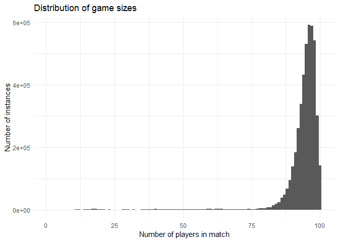
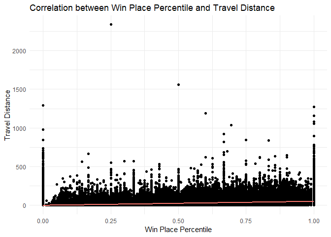
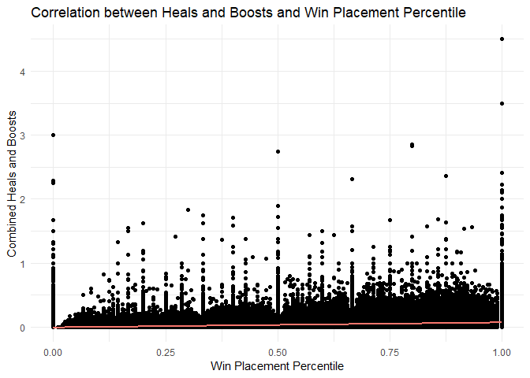

PUBG\_Preprocessing
================
Jonathan Hung
December 8, 2018

PUBG Preprocessing
==================

After the Exploratory Data Analysis (EDA), we can begin to attempt to engineer and model the dataset to predict the winPlacePerc based on the variables given.

Imports
-------

Import the dataset and useful libraries here.

``` r
# import the datasets
library(readr)
train <- read_csv("train_V2.csv")
```

    ## Parsed with column specification:
    ## cols(
    ##   .default = col_integer(),
    ##   Id = col_character(),
    ##   groupId = col_character(),
    ##   matchId = col_character(),
    ##   damageDealt = col_double(),
    ##   longestKill = col_double(),
    ##   matchType = col_character(),
    ##   rideDistance = col_double(),
    ##   swimDistance = col_double(),
    ##   walkDistance = col_double(),
    ##   winPlacePerc = col_double()
    ## )

    ## See spec(...) for full column specifications.

``` r
test <- read_csv("test_V2.csv")
```

    ## Parsed with column specification:
    ## cols(
    ##   .default = col_integer(),
    ##   Id = col_character(),
    ##   groupId = col_character(),
    ##   matchId = col_character(),
    ##   damageDealt = col_double(),
    ##   longestKill = col_double(),
    ##   matchType = col_character(),
    ##   rideDistance = col_double(),
    ##   swimDistance = col_double(),
    ##   walkDistance = col_double()
    ## )
    ## See spec(...) for full column specifications.

``` r
# convert to dataframe for ease of use
train_df <- as.data.frame(train)
test_df <- as.data.frame(test)
```

``` r
# import useful libraries
library(ggplot2, quietly = TRUE, warn.conflicts = FALSE)
```

    ## Warning: package 'ggplot2' was built under R version 3.4.4

``` r
library(caret, quietly = TRUE, warn.conflicts = FALSE)
```

    ## Warning: package 'caret' was built under R version 3.4.4

``` r
library(dplyr, quietly = TRUE, warn.conflicts = FALSE)
```

    ## Warning: package 'dplyr' was built under R version 3.4.4

Feature Scaling
---------------

As noted in the PUBG dataset, games can have up to 100 players BUT not all games are full. Thus, we need to identify how many players are in each game, add on a column to each row with this number and then scale our features.

### Number of players per match

First, we identify the number of players in each match.

``` r
# find number of players in a match by matchId
# this creates a new column and counts the number of instances of a matchId for that row
# appearing in the rest of the dataset
train_df$player_count <- as.numeric(ave(train_df$matchId, train_df$matchId, FUN = length))
```

And we can take a look at the distribution of match sizes in the dataset.

``` r
# plot of match sizes
ggplot(train_df, aes(x = player_count)) +
  theme_minimal() +
  xlab("Number of players in match") +
  ylab("Number of instances") +
  ggtitle("Distribution of game sizes") +
  geom_histogram(binwidth = 1)
```



And we can see that most games have 90+ players in them.

### Scaling

Now we have to scale the features so that we effectively have a number per player for our variables of interest.

``` r
# scale variables in train_df
# use mutate() to apply to all rows in the column
train_df <- train_df %>%
  mutate(assists = assists / player_count) %>%
  mutate(boosts = boosts / player_count) %>%
  mutate(damageDealt = damageDealt / player_count) %>%
  mutate(DBNOs = DBNOs / player_count) %>%
  mutate(headshotKills = headshotKills / player_count) %>%
  mutate(heals = heals / player_count) %>%
  mutate(killPlace = killPlace / player_count) %>%
  mutate(killPoints = killPoints / player_count) %>%
  mutate(kills = kills / player_count) %>%
  mutate(killStreaks = killStreaks / player_count) %>%
  mutate(longestKill = longestKill / player_count) %>%
  mutate(matchDuration = matchDuration / player_count) %>%
  mutate(maxPlace = maxPlace / player_count) %>%
  mutate(numGroups = numGroups / player_count) %>%
  mutate(rankPoints = rankPoints / player_count) %>%
  mutate(revives = revives / player_count) %>%
  mutate(rideDistance = rideDistance / player_count) %>%
  mutate(roadKills = roadKills / player_count) %>%
  mutate(swimDistance = swimDistance / player_count) %>%
  mutate(teamKills = teamKills / player_count) %>%
  mutate(vehicleDestroys = vehicleDestroys / player_count) %>%
  mutate(walkDistance = walkDistance / player_count) %>%
  mutate(weaponsAcquired = weaponsAcquired / player_count) %>%
  mutate(winPoints = winPoints / player_count)
```

    ## Warning: package 'bindrcpp' was built under R version 3.4.4

And with this, we have scaled all the features based on the number of players in each game.

Feature Engineering
-------------------

We can reduce the dimensionality of the dataset as well as increase the usefulness of some variables by engineering them.

### Travel Distance

We can aggregate the distances travelled to better explain them.

``` r
# new column for total distance travelled
train_df <- train_df %>%
  mutate(travel_distance = walkDistance + rideDistance + swimDistance)
```

And check their relation to winPlacePerc.

``` r
# plot our new feature
ggplot(train_df, aes(x = winPlacePerc, y = travel_distance)) +
  theme_minimal() +
  xlab("Win Place Percentile") +
  ylab("Travel Distance") +
  ggtitle("Correlation between Win Place Percentile and Travel Distance") +
  geom_point() +
  geom_smooth(method = "lm", aes(colour = "red"), se = FALSE, show.legend = FALSE)
```

    ## Warning: Removed 1 rows containing non-finite values (stat_smooth).

    ## Warning: Removed 1 rows containing missing values (geom_point).



### Heals and Boosts

Heals and boosts should be combined as they do similar things. Heals recover hp up to 75% of maximum while boosts allow healing over 75%.

``` r
# combine them
train_df <- train_df %>%
  mutate(heals_and_boosts = heals + boosts)
```

And check the correlation of the new feature.

``` r
# plot of winPlacePerc and heals_and_boosts
ggplot(train_df, aes(x = winPlacePerc, y = heals_and_boosts)) +
  theme_minimal() +
  xlab("Win Placement Percentile") +
  ylab("Combined Heals and Boosts") +
  ggtitle("Correlation between Heals and Boosts and Win Placement Percentile") +
  geom_point() +
  geom_smooth(method = "lm", aes(colour = "red"), se = FALSE, show.legend = FALSE)
```

    ## Warning: Removed 1 rows containing non-finite values (stat_smooth).

    ## Warning: Removed 1 rows containing missing values (geom_point).



### AFKs and Cheaters

Every game is plagued by these kinds of players. AFK players who load into the game to not actually play the game. Cheaters who use tools to win the game more easily compared to others. In both cases, these players contribute nothing but absurd outliers to the data (e.g. cheaters who can kill other players without much effort, think no distance travelled yet somehow having a lot of kills).

Of course, we can't actually just straight up remove them from the dataset, the test dataset itself likely has cheaters and AFK players in it as well, so we need features to be able to distinguish them from other players.

``` r
# afk players feature
# afk players likely don't move, don't deal damage and don't ever acquire a weapon
train_df$is_afk <- ifelse(train_df$travel_distance == 0 & train_df$damageDealt == 0 &
                                train_df$weaponsAcquired == 0, 1, 0)
```

``` r
# cheater players features
# cheating players likely look like afk players, but somehow do things like kill other players
# why move and do things when you can just kill people from spawn?
train_df$is_cheater <- ifelse(train_df$travel_distance == 0 & train_df$kills > 0, 1, 0)
```

Now we have features for people who are afk or cheating. This should allow our model to differentiate them.

### Map Knowledge

In games like these, having in depth knowledge of the map is very useful. There's a reason that guides exist that show where the best spawn points are (higher loot density). Certain types of weapons also only spawn in certain places and knowing where they are can be a big advantage.

Thus, we create a feature that tries to capture this.

``` r
# map knowledge feature
# +1 added to prevent a divide by 0 situation
train_df <- train_df %>%
  mutate(map_knowledge = (weaponsAcquired + boosts + heals) / (travel_distance + 1))
```

It stands to reason that a player that can find more weapons, boosts and heals per distance walked likely knows the map better to be able to more efficiently find them.

### Recategorize matchType

There a lot of different match types in the dataset, yet they can really just be categorized as "solo", "duo", "squad", "crash" and "flare" games. We can recategorize them to reduce the number of levels in the columns for matchType.

``` r
# rename solos
train_df$matchType[train_df$matchType == "normal-solo" |
                     train_df$matchType == "normal-solo-fpp" | 
                     train_df$matchType == "solo-fpp"] <- "solo"

# rename duos
train_df$matchType[train_df$matchType == "duo-fpp" |
                     train_df$matchType == "normal-duo" |
                     train_df$matchType == "normal-duo-fpp"] <- "duo"

# rename squads
train_df$matchType[train_df$matchType == "squad-fpp" | 
                     train_df$matchType == "normal-squad" |
                     train_df$matchType == "normal-squad-fpp"] <- "squad"

# rename crash
train_df$matchType[train_df$matchType == "crashfpp" |
                     train_df$matchType == "crashtpp"] <- "crash"

# rename flare
train_df$matchType[train_df$matchType == "flarefpp" |
                     train_df$matchType == "flaretpp"] <- "flare"
```

And now we only have 5 levels for the matchType variable.

### One hot encode matchType

Now that we've reduced matchType to just 5 levels, we can one hot encode them for modelling later on.

``` r
# one hot encode
dmy_train <- dummyVars("~matchType", data = train_df, fullRank = TRUE)
dummy_train <- data.frame(predict(dmy_train, newdata = train_df))

# cbind it to train_df
train_df <- cbind(train_df, dummy_train)
```

### Memory Reduction

To make the dataset faster to model, it would be prudent to remove columns that we know are of no use (e.g. matchId) to reduce the size of the dataset that will be processed.

Removal: \* Id, matchId, groupId: Removed as they do not contribute to the model \* numGroups: Removed as the number is not reflective of the actual number of players in a match \* player\_count: We used this to scale the data, it's not needed here anymore \* walkDistance, swimDistance, rideDistance: These 3 were added up to make travel\_distance so they are not as useful now \* heals, boosts: They were added up to make heals\_and\_boosts so they are not that useful now \* matchType: We one hot encoded this column so keeping matchType itself is a little pointless

``` r
# list of columns to be dropped
drops <- c("Id", "groupId", "matchId", "maxPlace", "numGroups", "player_count", "walkDistance",
           "swimDistance", "rideDistance", "heals", "boosts", "matchType")

# remove the columns
train_df <- train_df[ ,!(names(train_df) %in% drops)]
```

### Test dataset processing

Modifying the training dataset means that we have to modify the test dataset as well in order to make predictions on it. Thankfully, this means we can reuse most of the code from before.

``` r
# find the player count of matches in the test dataset
test_df$player_count <- as.numeric(ave(test_df$matchId, test_df$matchId, FUN = length))

# scale accordingly
test_df <- test_df %>%
  mutate(assists = assists / player_count) %>%
  mutate(boosts = boosts / player_count) %>%
  mutate(damageDealt = damageDealt / player_count) %>%
  mutate(DBNOs = DBNOs / player_count) %>%
  mutate(headshotKills = headshotKills / player_count) %>%
  mutate(heals = heals / player_count) %>%
  mutate(killPlace = killPlace / player_count) %>%
  mutate(killPoints = killPoints / player_count) %>%
  mutate(kills = kills / player_count) %>%
  mutate(killStreaks = killStreaks / player_count) %>%
  mutate(longestKill = longestKill / player_count) %>%
  mutate(matchDuration = matchDuration / player_count) %>%
  mutate(maxPlace = maxPlace / player_count) %>%
  mutate(numGroups = numGroups / player_count) %>%
  mutate(rankPoints = rankPoints / player_count) %>%
  mutate(revives = revives / player_count) %>%
  mutate(rideDistance = rideDistance / player_count) %>%
  mutate(roadKills = roadKills / player_count) %>%
  mutate(swimDistance = swimDistance / player_count) %>%
  mutate(teamKills = teamKills / player_count) %>%
  mutate(vehicleDestroys = vehicleDestroys / player_count) %>%
  mutate(walkDistance = walkDistance / player_count) %>%
  mutate(weaponsAcquired = weaponsAcquired / player_count) %>%
  mutate(winPoints = winPoints / player_count)

# create the travel_distance feature
test_df <- test_df %>%
  mutate(travel_distance = walkDistance + rideDistance + swimDistance)

# create the heals_and_boosts feature
test_df <- test_df %>%
  mutate(heals_and_boosts = heals + boosts)

# create the is_afk feature
test_df$is_afk <- ifelse(test_df$travel_distance == 0 & test_df$damageDealt == 0 &
                                test_df$weaponsAcquired == 0, 1, 0)

# create the is_cheater feature
test_df$is_cheater <- ifelse(test_df$travel_distance == 0 & test_df$kills > 0, 1, 0)

# create the map_knowledge feature
test_df <- test_df %>%
  mutate(map_knowledge = (weaponsAcquired + boosts + heals ) / travel_distance)

# rename solos
test_df$matchType[test_df$matchType == "normal-solo" |
                     test_df$matchType == "normal-solo-fpp" | 
                     test_df$matchType == "solo-fpp"] <- "solo"

# rename duos
test_df$matchType[test_df$matchType == "duo-fpp" |
                     test_df$matchType == "normal-duo" |
                     test_df$matchType == "normal-duo-fpp"] <- "duo"

# rename squads
test_df$matchType[test_df$matchType == "squad-fpp" | 
                     test_df$matchType == "normal-squad" |
                     test_df$matchType == "normal-squad-fpp"] <- "squad"

# rename crash
test_df$matchType[test_df$matchType == "crashfpp" |
                     test_df$matchType == "crashtpp"] <- "crash"

# rename flare
test_df$matchType[test_df$matchType == "flarefpp" |
                     test_df$matchType == "flaretpp"] <- "flare"

# one hot encode
dmy_test <- dummyVars("~matchType", data = test_df, fullRank = TRUE)
dummy_test <- data.frame(predict(dmy_test, newdata = test_df))

# cbind it to train_df
test_df <- cbind(test_df, dummy_test)

# remove the columns
test_df <- test_df[ ,!(names(test_df) %in% drops)]
```

The test\_df dataframe is now processed in the same way as train\_df. In hindsight, it would've made more sense to process the test\_df dataframe at the same time as train\_df.
